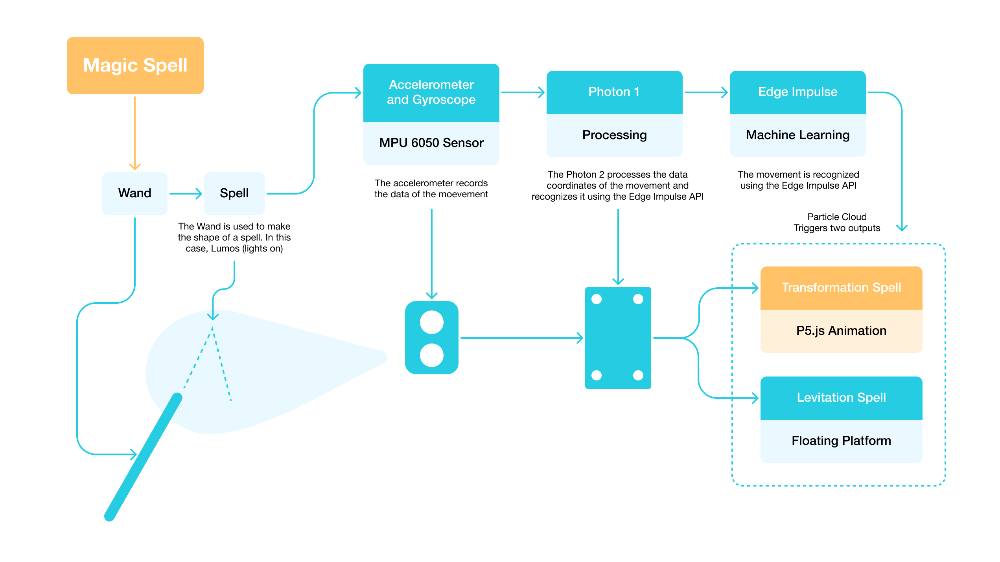
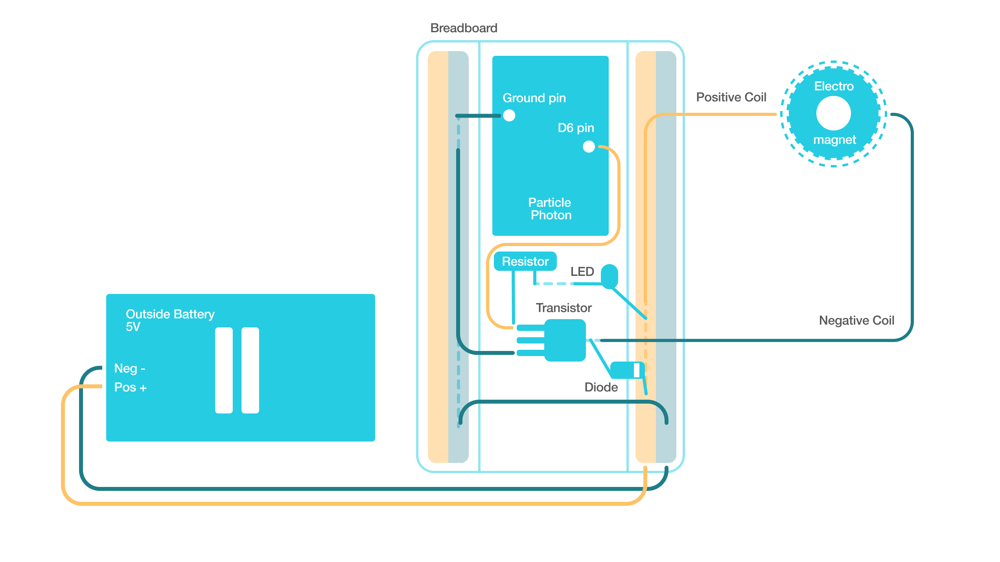

# Hello, TDF Instructors and TAs!
Welcome to my GitHub repository! - Isabella Wang :)  

   
   
   

# Outline
⭐️ [Week 1](README.md#%EF%B8%8F-week-1---report-1)

⭐️ [Week 2](README.md#%EF%B8%8F-week-2---report-2)

⭐️ [Week 3](README.md#%EF%B8%8F-week-3---report-3)

⭐️ [Week 4](README.md#%EF%B8%8F-week-4---report-4)

⭐️ [Week 5](README.md#%EF%B8%8F-week-5---report-5)

⭐️ [Week 6](README.md#%EF%B8%8F-week-6---report-6)

⭐️ [Week 7](README.md#%EF%B8%8F-week-7---report-7)

 
 
 

# 🗓️ Week 1 - Report 1 #
## Week of 09/02/2024

### Introduction

This week i laser cut 2 pill boxes out of plywood.

The idea was for me and my roomate to have a matching set. The flower shape gives a friendly and girly appearance.
The flower top spins around and snaps onto the open sections, leaving access to retrieve the contents.

We thought about 3d printing it, but decided aginst it because of the texture and cheap feel. The plywood gives a heavier sensation and a nicer finish. 

   

### Process

1. Ai the layers
2. Cut the layers out of 3/4 plywood
3. Stack the layers with wood glue and clean up the edges
4. Sand the edges and surfaces

### Hiccups
1. We ran out of magnets and havent been able to test the mechanism.
2. I tried to sand off the burnt edges of the laser cut, but was dissapointed with the result. It looks patchy and oddly naked.

   
   

### Next steps

1. Purchase magnets and place them
2. Paint sides
3. Assemble the pill box
4. Put vitamins inside

 
 

# 🗓️ Week 2 - Report 2 #
## Week of 09/09/2024

📌 [Monday - Grasshopper Experimentation](README.md#monday---grasshopper-experimentation)

📌 [Thursday - Class Exploration](README.md#thursday---class-exploratioon) 

📌 [Weekly Update - Computational Design Research](README.md#weekly-update---computational-design-research) 

 

## Monday - Grasshopper Experimentation

### Diagrams

   
   

   

The diagrams were made by readign each of the nodes and identifying how they feed into each other. It was especially helpfull to understand that almost all parameters are customizable.
The designer has to create a system in which those nodes interact. Grasshopper allows to only define the overall arcitecture has to be defined. All minutia can be altered at any point. 

E.G.
In the current design, the smaller spehere remains substracted from the bigger sphere. But the designer is still able to change any size and alignment.
While the phone would be a headache to remove, the size, thickness and alignemnemt to the table can be easily altered.

 

### Baked forms

**First test:**
- Wanted a portrait mode phone
- This lead to thicker walls for balance. The ball on the backside grew until about half the phone height.
- The limits on threshhold caused the substracted cylinder to be shifted upwards.
- The phone distance from the table was shortened

   
   
   

 

**Second test:**
- Wanted to do the lowest lanscape mode i could
- I changed the Z on both of the speheres and the cylinder
- It was a balance between getting lower but not triggering the threshold warnings
- the phone was the lowest it could go without risking the area below being too thin to crack

   
   
   

 

**Third test:**
- Wanted a round back section of the stand
- I shifted both spheres as low as they would go
- This is the design im most content with.
- Thye round look gives it an adorable and approachable style im drawn to

   
   
   

 

## Thursday - Class Exploratioon

Following along to the class tutorial. I was a bit lost doing Grasshopper from the start. It was easy to decode what the pre-made file was doing. It was mostly reading through the nodes and seeing how they connected. Making it, required knowing where to find the relevant buttons and requests, which i kept losing in the screen. I ended up getting help from my table mates, who guided me through it

The shape was simple, just a squaew with a cylinder substracted from it. But it made me realize how usefull the modularity of Grasshopper is. In any other program like Fusion or Blender, the shapes are pretty set in stone; having parameters that are easy to edit sppeds the testing process along. 

   

   
   
   

 

## Weekly Update - Computational Design Research

### Inspiration Board
I took inspiration from Retro product design, specifically lamp designs. Im attracted to the round and homely feel. 
The transparecy and sleekness to the acrylic give it a visually appealing look. 
After looking through alternatives, I decided for a magnetic stand. It supports the most devices and it's easiest to interact with

   

### Possible Diagram
- The design will have a round base
- Going up to a column.
- On the top there will be a ball bearing holding up the magnet. The ball bearing allows for ease of changing the phones angle and orientation. 

### Next steps
1. Making the sketch of the stand in paper
2. Making model in Grashopper

 
 

# 🗓️ Week 3 - Report 3 #
## Week of 09/09/2024

📌 [VIDEO LINK](https://youtu.be/56ulLLgMZa8)

 

## Computational Design - Process and Final

### Rhino + Grasshoper
1. I began by determining the shape of the base. I tried to make it by substracting a donut shape from a cylinder in order to have a sloped angle from the body to the lower section. But i was dissatiesfied with the result. I ended up making a low cylinder with a cone on top
2. For the body i made a circle adn extruded it into a cylinder
3. For the top section fo the body I made 2 points to determine the start and end of an arc
4. I made a circle and extruded it starting from the top section of the body cylinder. Then used the "bend" node to bend the cylinder along the arc
5. I capped all the forms and did solid union to join them together

### Physical Process
1. I laser cut all the pieces from acrylic in the recycling bin
2. I peeled all the acrylic bits
3. I tried to attach the pieces with a heating gun, and it did work very well because it left no marks. But the pieces unstuck from themselves
4. So I switched to acrylic weld, attaching all the pieces together
5. After I attahced them, the transparent material displayed bubbles and imperfections from the weld
6. I tried to polish it, re-attaching pieces and softly dremeling. I ended up deciding for sandining the surface
7. I sanded the full surface to make it foggy. The finish was smoother to the touch and fit perfect with its purpose
8. I attached the ball bearing and magnet i purchased from amazon (it cost 8 bucks for 2 mounts)
9. It was working when the phone was only in portrait mode. I wanted to be able to rotate it in all angles so I had to attach a final bigger ring to offset the weight. 

### Reflections
1. I enjoyed the matieral way more than 3D printing it. I thought 3D printing it would make it too light and flimsy, the acrylic gave it the weight it needs to feel like a product adn not a draft
2. The foggy final texture was my favorite happy accident. It's so satifying to interact with. Even people who have laser cut acrylic before are a bit perplexed by the finish
3. Im glad i spent my time in the design of the body instead of dealing with the minutia of making a ball bearing. Purchasing that part allowed me to thing of the whole as a system and not wase time in details
4. Im very pleased with the final design
5. Im very surprised i was able to navigate Grasshopper and Rhino with ease towards the end. I was very baised towards working with Blender or Fusion as I have experience in them, but as I worked more with Grasshopper I understood why its the best tool to use for designs you are not entirely sure about. It's best for drafting and deciding than any other program

### What I would do different
1. I would sand the independent pieces before attachign them. Since I didnt know that was the texture I wanted, I sanded it after attaching.
2. I would make a jig to make sure all the pieces are attached in the correct place. In this version I used rulers and additional pieces but it still had bumps and misaligned pieces. 

### Video
📌 [VIDEO LINK](https://youtu.be/56ulLLgMZa8)

 
 

# 🗓️ Week 4 - Report 4 #
## Week of 09/16/2024
Over this week i made the video and delivered the report displayed on last weeks report

### Video
The video took a lot of time spent in premiere. I used a stop motion inspiration from this Ted Talk video
   
📌 [Ted Talk]([https://youtu.be/56ulLLgMZa8](https://www.youtube.com/watch?v=NKgXBjkKI_E)

I used the following script:

Once upon a time, the lonely Phone could not stand

His smooth corners and plastic case made him slippery and weak

He could not be used to record

He has fallen so many times from piles of things

He has slipped down slowly, seeing his life pass by while on Facetime

He has been left in the table, pissing off whoever was on the other end of the call

He’s tired, he’s scared about his screen cracking, he knows he cannot continue like this

Hes been on the apps and looked around for a base. 

But they are too clunky, to solid or to stiff

BUT WHATS THAT I SEE, APPEARING SOLID IN THE GROUND??

SUPER PHONE STAND

wooo

They say phone stand was born in a planet called “Grasshopper” and they used to ride Rhinos for fun

They are so strong

They have a ball bearing head

A body of solid acrylic and a strong base that weighs them down

So cool

Legend says Phone Stand was born from nodes.

Joining a big cylinder and a cone for the base. Another cylinder and a deformed cylinder for the body.

Entirely parametric, they were chosen from many iterations.

Phone stand has the sleekest most efficient design out there

They were built by welding many pieces of acrylic together. Sanded to be smooth and foggy

(disclaimer this action was performed by professionals, do not attempt at home, only at Jacobs)

Phone stand can rotate their head at so many angles

They can turn up, down and at any direction

They are so solid in the ground they cannot tip over!

And the best part yet

The magnetic head!!!! so they can save the life of so many devices of many sizes

They adapt! They are the very image of resilience

Only thing is that they are blind.

And look at that! PhoneStand has vaguely spotted our lonely Phone

Phone has been swooped off his feet

It is love at first sight

And they are effortlessly attached

Aweeeeeee

Look at them so happy.

They can now explore the world.

Phone is the eyes

Phone Stand is the support

They complement each other perfectly

They can film videos, do facetime calls, and protect each other from falls and cracks

Never seen anything like it before

 Its a brand new world for our super couple

So please, purchase this incredible phone stand from Isabella Wang

You wouldn’t want your phone to miss out on the love of their life 

Everyone needs a little support

Thank you DesInv202. Im an axolotl give me max score plz

See u soon

Isabella

### Sketches, Drawings, and Diagrams

While there wasnt Sketches, Drawings, and Diagrams, there was a lot of other files I used for the video

Such as:
1. Videos I recorded
2. Photos I took
3. PNGs I edited
4. Stop motion frames of PNGs
5. Background and texture files
6. The main sound audio
7. Sound effects
8. Music
   

   
   

### Reflections
I am very happy with the result of the video. It emphasizes storytelling, humanizing the objects and giving them more appeal. I had a lot of fun making it because it became a game of how to make it siller and prettier. Using the TedTalk as inspiration kept me reaching for more and more cretaive addditions. 

When presented, all my classmates really enjoyed it. They clapped and asked how i made it

### Speculatinons

While I made a  very creative video, I missed a quite a bit of the technical background relating to Computational Design. I wanted the focus to be in making a dynamic video, showing the parameters, and not info dumping explanations. I expect I will have to mak eup for it when making the report.

 
 

# 🗓️ Week 5 - Report 5 #
## Week of 09/23/2024

### Super Phone Stand - Report

Overview
- Level 3, Axolotl
- Experimentation: 3D printing, Attempted to bend acrylic, Welded acrylic, Sanded acrylic, First time using Grasshopper and Rhino
- ​​AEIOU Framework
- Diagrammatic Analysis of your System
- Prototype Demonstration
- Project Challenge Results
- Speculations
- Peer Feedback Response
-  Conclusion

### Diagrams

   
   

### Reflections

The report spanned about 10 pages, it was very in-depth exploration of Computational Design as observed in the phone stand
"I am quite pleased with the results. I learned a lot about Grasshoppers and Rhino. Learned how to navigate parameters, make a system for a product rather than jumping straight into a single version. Learned how to use heat mending, acrylic weld and assembly. Learned how to sand and smooth the surface of acrylic for a foggier finish."

### Speculations

"Predictions of Anthropogenic Studies may align with the actual human experience, but observation is king. Assumptions and educated guesses permanently fall short next to the careful study by simple observation and note taking. The combination of experimentation and observation skills combine into the deepest understanding of human behavior.

This affects design, engineering and everyday life. AI may be able to analyze and summarize with accuracy, but it can't identify minutiae of things yet, because it needs to be prompted to know what to look for. And if it's something brand new, it will simply walk blind."

 
 

# 🗓️ Week 6 - Report 6 #
## Week of 09/30/2024

This week I was able to get the LED pulse rate microtutorial.

I had been really struggling because my Photon 2 was not connecting. It would return errors everytime I compiled or flashed any code. 
I had spent days trying to re-set my passwords and re-do the onboarding to no avail. I even spent one hour on sunday with Jeff trroubleshooting it
The result: havign to replace the Photon board

Once I did get it replaced, i flew through the first tutorial
I had already repeted the steps so many times i was confident. I compiled and flashed the code. connected the wires, LEDs, transistors and button and flashed again
It worked on the first try

   
   

### Reflections
I wish i had not wasted so much time trying to solve it on my own and had just reached for help when i realized there was somethign wrong. I would have not undone a lot of the work that was correct, like the BerkeleyiOt password. It would have saved me days of struggle and I would have been able to explore more tutorials. 

### Diagrams
First Photon 2 board -> struggle -> re-wire -> re-code -> check every component 100 times
Second Photon board -> compile and flash -> wire -> see results

### Speculations
I speculate a lot more smooth sailing from now. I'll be able to quickly familiarize myself with the system and do other projects. Or at least I hope this is the last mayor hiccup

 
 

# 🗓️ Week 7 - Report 7 #
## Week of 10/7/2024

This week we began forming teams and planning our second project for Build a Digital EcoSystem.
I teamed up with Jiaqui and Precious to undertake building an interactive game using ML and p5.js

The goal of this project is to explore the use of Particle Photon 2 devices, Particle Cloud Services, and STEMMA QT-based sensors and actuators to develop a system for casting a magic spell. The input will be the motion data of waving the wand. Through machine learning, a collection of motion data will then be categorized and recognized as a spell. The spell will trigger a respective p5 js animation displayed in a screen/projection. If time allows, we would expand on making the output more physical using actuators such as motors, LEDs, etc.

### Diagram
  

Since my responsability is to create the setup, i have to because very aquainted with the relevant sensors
In this case:
1. The Accelerometer and Gyroscope: for the motion recognition
2. The OLED: possibly for the display, but most likely it will be projected for a bigger scale
3. The Speakers: to add sound effects or background audio

   
 

   
 

   
 

### Reflections
I'm responsable for the Photon 2 and the rigging of the sensors. 
I think we have worke great as a team so far. Communication and coordinating have been without hiccups. 
I believe the project is a great balance between childhood nostalgia and modernized approach. Its something that could be marketable to harry potter fanatics or Disneyland parks. It doesnt have the deepest societal impact, but it's a project that brings joy, and theres great value in that.

### Speculations
I speculate that we will have a lot of fun with this project. The subject matter is fun and appealing. It does not seem like a daunting task but more like a joyfull project to undertake. Since my experience with the board is limited to hte experimentd taken in class, i expect to learn a lot in a short amount of time. For example: the proper way to handle sensors and the ideal set-up for HCI. I'm aiming to build something functional but also user friendly.

 
 

# 🗓️ Week 8 - Report 8 #
## Week of 10/14/2024

Project 2 Developments

Goal: 
To make a platform that makes an obejct float when triggered by a magic wang

Responsabilities:
1. Figuring out system for the floating
2. Begin prototyping

**Experiment 1: No magnets**
In order to create the floating platform, there were many iterations. The first idea was a plywood laser cut base. Two strings would pull the object upward, as a servo motor rotates underneath. After making the laser cut pieces for it and assembling it, this idea seemed too simple and boring

**Experiment 2: Electromagnets**
The idea that moved forward was to trigger the floating by using electromagnets. Electromagnets are magnets made of coils of wire with electricity passing through them, and unlike regular magnets they can be turned on and off.

   
 

The first layout had 4 EMs and 8 columns of 3 neodymium magnets (NM) over a metal base. After cutting, sanding and CADing the layout, I realized that the amount of electromagnets required a great amount of voltage, significantly more than the Photon could provide. 

   
 

### Reflections
The pivot to electromagnets added more possibilities. It prompted a deep dive into magnets, magnetic fields, understanding power and energy limitations. Im quite happy with the current direction and while it adds a lot of work, it also looks veyr fun to delve into.

### Speculations
Looking forward, it’s likely that further iterations will explore alternative power configurations or fewer electromagnets to reduce the energy burden while maintaining the floating effect. Perhaps using a combination of permanent magnets and strategically placed electromagnets could achieve the desired effect with less power. Another avenue could be investigating external power supplies or more efficient electromagnets to reduce power consumption. Considering these trade-offs might lead to a design that is both visually engaging and technically feasible.

 
 

# 🗓️ Week 9 - Report 9 #
## Week of 10/21/2024

  

The CAD from last week carried over into this week. 

There were many complications while pinning. At first I explored using a relay to regulate the voltage. The relay would act as a doorway in between the outside energy source and the photon, to prevent it from being burned. However, the relay would fire the energy back into the Photon once the doorway closed, effectively burning it. The Photon had been having great issues compiling and flashing code, and would not connect to the network. I've just recieved a new Photon to resume testing new alternatives.

   
 

### Reflections
I'm not quite scared of burning the Photon or the relay as i am of burning my computer, which I was warned is a risk. I've been a bit reckless testing with giant magnets and EM coils near my very sentive tech that I costs a lot and I care a lot about. 

I've also pinched my fingers so many times between magnets, it hurts. 

### Speculations
There is 4 paths forward:
1. Experimenting with Voltage Regulation: Swapping the relay for other components
2. Possibly Moving to a More Robust Microcontroller: I have a access to an Arduino UNO
3. Reconsidering Power Sources: I could use the wall as a source
4. Looking Into Code Solutions for Voltage Spikes: Regulate the on/off to not allow it to burst?

 
 

# 🗓️ Week 10 - Report 10 #
## Week of 010/28/2024

  

The project has been submitted

The successful circuit is as follows: The transistor's emitter connects through the photon's D6 pin, and to the negative of the EM coil. The transistor's emitter connects to the positive of the EM coil through a diode; connects to the external battery’s positive; and also connects to an LED to indicate if the EM is on. The transistor's base and the external battery are connected to the Photon’s ground.

  

The final design featured a second platform with a single electromagnet powered by a 4 double A battery pack, above the neodymium magnet, to pull it upward instead of repelling it. When the coil is turned on, the magnet is attracted and starts floating.

  

Transistor and Diode
The transistor and diode worked effectively, yet I still needed help wiring it, because I was not successful after hours of iterations and searches. The LED is a signal that lights up when the EM is on and magnetized. It serves as a visual cue on when to test it.

### Reflections
Honestly, I’m quite stubborn once set on a goal. Once I had determined I wanted to do an EM floating platform, I just worked tirelessly for it. I enjoy the process of testing and discovering. The number of experiments were simply steps I had to take. I did work quite hard on the prototype and I'm very glad it works. 

I did learn that I should ask for help sooner rather than later. Something that I have taken days trying to solve, the TAs or teachers can solve in minutes. I should not have struggled without reaching out for so long. I know it's something that put stress onto my teammates because they didn't see clear progress, and i will make sure to do better in the future

### Speculations
Human experiences, what might be different about cultural expectations of the Anthropogenic Environment?
The Magic Spell Project reimagines storytelling and play by tapping into human experiences through ML and physical prototypes. By recognizing gestures and responding interactively, the technology deepens users' sense of immersion and control, making them feel as though they’re truly casting spells. This approach could open doors to more personalized interactions, enabling users to shape their own stories within a responsive, interactive world.

 
 

# 🗓️ Week 10 - Report 10 #
## Week of 010/28/2024

During class we did an exploration of ZeroWidth, an AI tool for making AI Chatbots.
First, I explored temperature adjustments in a baseline experiment, observing how these settings influenced response creativity. 

Experiment 01 - GPT 
Workbench: https://zerowidth.ai/workbench/ADj61KFYM8LZH56dtMFT/projects/DenMPhfEovyOH4y9MXyK/agents/V74hTJdtCUPYeLWoFxPI
Demo: https://zerowidth.ai/c/demo/V74hTJdtCUPYeLWoFxPI/draft

  

### Reflections
Since this exploration was very simple, there isnt much to reflect on. Its mostly just about following the instructions and explorating what each of the nodes and parameters do. My favorite parameter so far is the option of seelcting from a list of LLMs and how each gives a different content of response.

### Speculations
I think the application is very useful for creating your own chatbot. I think it will facilitate the use of LLMs in personal and smaller projects and it provides an easy introduction into the world of LLMs

 
 

# 🗓️ Week 11 - Report 11 #
## Week of 11/04/2024

### Experiment 02

I introduced prompts to the GPT LLM. It instructed the LLM to represent my academic and professional work.
The prompt “Allows for easy configuration of a prompt message and role to provide to an LLM” (zerowidth). It is a text input from the creator that is used as instructions for the LLM to format the responses. 

My prompt was: “You are an agent representing the professional and educational experience of Isabella Wang, also known as Isa. Include references to work as a product designer, creative technologist, graphic designer, animator and artist as appropriate to the conversation.”

 

### Experiment 03

This experiment required a change in prompt. Since the LLM had to retrieve information from a Knowledge Base, it had to be prompted to do so

The new prompt is: 

“You are an agent representing the professional experience of Isabella Wang, also known as Isa. Include references to his work as a product designer, creative technologist, graphic designer, animator and artist as appropriate to the conversation. 

Provide useful references to his work as related to the dialog shared in prompts. Here is some information that can help you answer the user's query: ${KNOWLEDGE)”

The content was uploaded into the Knowledge Base, sorted into chunks. By increasing the number of chunks, the LLM is able to sort through more specific information, and provide more accurate answers, but is more likely to get confused. The similarity threshold compared the message input to the Knowledge Base terms, looking for similar words. Increasing the threshold would limit the results by those who are most similar. 

I found the content worked better when it was sorted into sensical chunks. When I had first uploaded my resume, I had generated a random number of chunks from the given information, and ZeroWidth sorted it to have an average amount in each chunk. But it was better to input each section of the resume manually. It increased the number of chunks, but gave the most accurate results. 

 

### Experiment 04

This experiment had two different prompts: one for formatting the input question by Location and Year. And another prompt for formatting the response using the Knowledge Base. Both prompts had to be connected to their respective LLM.

The first prompt is: “Format the following as a question about Isabella Wang. In ${LOCATION}. During ${YEAR}.”

The second prompt remains mostly the same as experiment 03, but it adds: “Assume the query is related to this location in her life: ${LOCATION}. Assume the query is related to this year in her life: ${YEAR}”

The Knowledge base this experiment used, was the same as the last one. I set the sliders for Chunks and Similarity at the lowest so I could receive the best response and not cause delays or confusions for the LLM. 

 

### Reflections
These experiments showed me how important prompt design and knowledge base organization are for improving an LLM’s performance. In Experiment 02, I saw how clear instructions helped the LLM represent my diverse professional identity effectively. Experiment 03 taught me that manually curating knowledge base chunks, rather than relying on automated sorting, produced much more accurate and relevant responses. In Experiment 04, I realized that adding context like location and year to both the query and the response made the LLM’s answers even more precise and reduced confusion.

### Speculations
Future steps could integrate my skills to design an interactive dashboard for customizing prompts, adjusting knowledge settings, and visualizing LLM responses. Using animation, I could create motion graphics to illustrate how the LLM processes context. A prototype in tools like Figma would combine aesthetics and functionality, making the tool user-friendly and visually engaging.

 
 

# 🗓️ Week 12 - Report 12 #
## Week of 11/11/2024

### Project 03 - Experiment 05 - Sleep Deprivation

Video: https://www.youtube.com/watch?v=3FMEPCukzrI

 

Using the tools learned in experiments 1 through 4, I was able to build a sleep deprived version of myself. The LLM uses the Knowledge from the TDF database, where it has all the weekly reports listed. It is then prompted to represent the body of work created during the semester. And to answer in first person, as if it were me. The response generated by the first Chat GPT is then input into another Chat GPT so it can be rewritten depending on the variable “Hours of Sleep”. 

The second LLM is prompted to modify the message as follows:

“Rewrite the input message exactly as provided, using the variable ${HOURS_OF_SLEEP}. Adjust only the style and coherence of the message according to this variable—do not change the core content or meaning.

Here’s how to modify the message:

8 to 10: Rewrite the message with no changes 
7 to 6: Keep response mostly intact. Respond with a semi-formal tone, clear language, straight to the point.
5 to 4: change the tone to casual. Add filler words sometimes, such as "um", "like", "so",  and one or two grammatical errors. Add mostly filler words such as "um", "like", "so", make grammatical errors in 50% of words, add many random ellipses, add some questions back to the user with a tone of paranoia. use only lowercase letters
2: Respond "mm hm". Randomize the number of "m" between 3-10 and the number of "h" between 2-5. Alternate between "sure" and "nope. Leave me alone" 
1 to 0: Rewrite the response as "zzzz". Randomize the number of "z" characters between 20-40.”

 

### Reflections
The process of experimentation was longer than expected. Even though all the tools were available from the tutorials I wasn't able to properly prompt the second ChatGPT. It kept mis-reading the number of hours and causing random changes to the responses. Which led me to try making functions, other layouts and using many other notes to rectify the problem. 

In the end, I was able to make it work thanks to the help of a classmate, Aarya, who had a similar working mechanism. The initial layout of the nodes I had was correct. But the wording of the prompt had to be exact, and I was confusing it because I was using the wrong words. 

For the 3 personal questions, the toughest to adjust was “how many hours of sleep have you had today” because the LLM kept answering in terms of privacy, or would not log the number from the input variable. At first I tried to add it into the second prompt with many different iterations. I ended up adding it to the first prompt and having to change the language a lot so the LLM would respond accordingly.

My final design works exactly as I intended it to. The initial answers are coherent, relevant, informed and answered in first person. And the quality of response is directly affected by the the hours of sleep inputted. The experimentation provided all the steps to be able to build the prototype

### Speculations
What roles might AI play in...AI?

AI’s role in advancing its own field is transformative, enabling self-optimization, autonomous code writing, and adaptive learning. It can create robust testing environments, while also facilitating collaboration among different systems. Most compellingly, Humans could become partners and co-creator with AI, enhancing creativity and fostering innovative solutions. This raises important questions about the definitions of creativity, autonomy and dependency. 

 
 

# 🗓️ Week 13 - Report 13 #
## Week of 11/18/2024

 
 

---
## Quick Links ##

- [TDF Wiki](https://github.com/Berkeley-MDes/24f-desinv-202/wiki) - the ultimate source for truth and information about the course and assignments
- [Google Drive Folder](https://drive.google.com/drive/u/0/folders/1DJ1b6sSDwHXX6NRcQYt10ivyQSgU0ND6) - slides and other resources
- [bCourses](https://bcourses.berkeley.edu/courses/1537533) - where the grading happens
