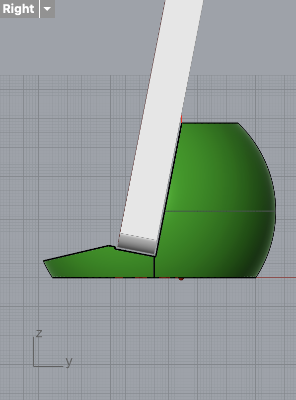
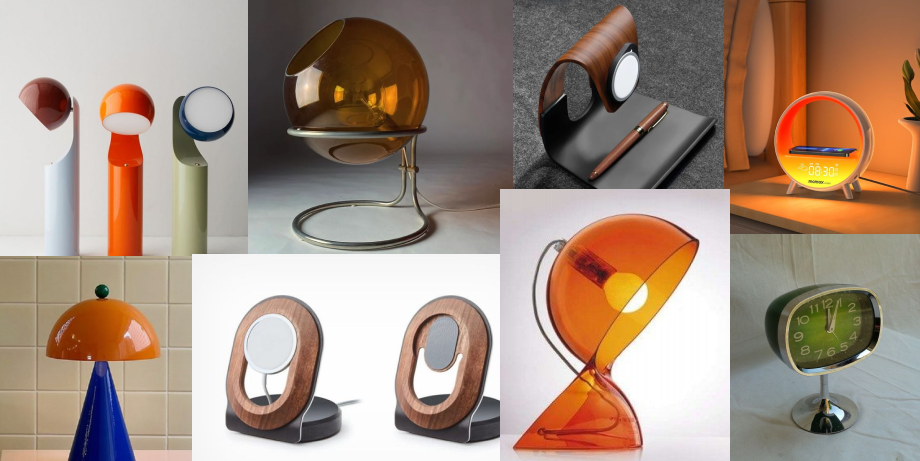

# Hello, TDF Instructors and TAs!
Welcome to my GitHub repository! - Isabella Wang :)  

   
   
   

# Outline
⭐️ [Week 1](README.md#%EF%B8%8F-week-1---report-1)

⭐️ [Week 2](README.md#%EF%B8%8F-week-2---report-2)

 
 
 

# 🗓️ Week 1 - Report 1 #
## Week of 09/02/2024

### Introduction

This week i laser cut 2 pill boxes out of plywood.

The idea was for me and my roomate to have a matching set. The flower shape gives a friendly and girly appearance.
The flower top spins around and snaps onto the open sections, leaving access to retrieve the contents.

We thought about 3d printing it, but decided aginst it because of the texture and cheap feel. The plywood gives a heavier sensation and a nicer finish. 

   

### Process

1. Ai the layers
2. Cut the layers out of 3/4 plywood
3. Stack the layers with wood glue and clean up the edges
4. Sand the edges and surfaces

### Hiccups
1. We ran out of magnets and havent been able to test the mechanism.
2. I tried to sand off the burnt edges of the laser cut, but was dissapointed with the result. It looks patchy and oddly naked.

   
   

### Next steps

1. Purchase magnets and place them
2. Paint sides
3. Assemble the pill box
4. Put vitamins inside

 
 

# 🗓️ Week 2 - Report 2 #
## Week of 09/09/2024

📌 [Monday - Grasshopper Experimentation](README.md#monday---grasshopper-experimentation)

📌 [Thursday - Class Exploration](README.md#thursday---class-exploratioon) 

📌 [Weekly Update - Computational Design Research](README.md#weekly-update---computational-design-research) 

 

## Monday - Grasshopper Experimentation

### Diagrams

   
   

   

The diagrams were made by readign each of the nodes and identifying how they feed into each other. It was especially helpfull to understand that almost all parameters are customizable.
The designer has to create a system in which those nodes interact. Grasshopper allows to only define the overall arcitecture has to be defined. All minutia can be altered at any point. 

E.G.
In the current design, the smaller spehere remains substracted from the bigger sphere. But the designer is still able to change any size and alignment.
While the phone would be a headache to remove, the size, thickness and alignemnemt to the table can be easily altered.

 

### Baked forms

**First test:**
- Wanted a portrait mode phone
- This lead to thicker walls for balance. The ball on the backside grew until about half the phone height.
- The limits on threshhold caused the substracted cylinder to be shifted upwards.
- The phone distance from the table was shortened

   
   
   

 

**Second test:**
- Wanted to do the lowest lanscape mode i could
- I changed the Z on both of the speheres and the cylinder
- It was a balance between getting lower but not triggering the threshold warnings
- the phone was the lowest it could go without risking the area below being too thin to crack

   
   
   

 

**Third test:**
- Wanted a round back section of the stand
- I shifted both spheres as low as they would go
- This is the design im most content with.
- Thye round look gives it an adorable and approachable style im drawn to

   
   
   

 

## Thursday - Class Exploratioon

Following along to the class tutorial. I was a bit lost doing Grasshopper from the start. It was easy to decode what the pre-made file was doing. It was mostly reading through the nodes and seeing how they connected. Making it, required knowing where to find the relevant buttons and requests, which i kept losing in the screen. I ended up getting help from my table mates, who guided me through it

The shape was simple, just a squaew with a cylinder substracted from it. But it made me realize how usefull the modularity of Grasshopper is. In any other program like Fusion or Blender, the shapes are pretty set in stone; having parameters that are easy to edit sppeds the testing process along. 

   

   
   
   

 

## Weekly Update - Computational Design Research

### Inspiration Board
I took inspiration from Retro product design, specifically lamp designs. Im attracted to the round and homely feel. 
The transparecy and sleekness to the acrylic give it a visually appealing look. 
After looking through alternatives, I decided for a magnetic stand. It supports the most devices and it's easiest to interact with

   

### Possible Diagram
- The design will have a round base
- Going up to a column.
- On the top there will be a ball bearing holding up the magnet. The ball bearing allows for ease of changing the phones angle and orientation. 

### Next steps
1. Making the sketch of the stand in paper
2. Making model in Grashopper

 
 

# 🗓️ Week 2 - Report 2 #
## Week of 09/09/2024

📌 [VIDEO LINK](https://youtu.be/56ulLLgMZa8)

 
 
---
## Quick Links ##

- [TDF Wiki](https://github.com/Berkeley-MDes/24f-desinv-202/wiki) - the ultimate source for truth and information about the course and assignments
- [Google Drive Folder](https://drive.google.com/drive/u/0/folders/1DJ1b6sSDwHXX6NRcQYt10ivyQSgU0ND6) - slides and other resources
- [bCourses](https://bcourses.berkeley.edu/courses/1537533) - where the grading happens
